---

title: 'Configuring Cryptocat'

abstract: In this guide, you will learn how to set up and use [Cryptocat's](https://crypto.cat) encrypted instant messaging service for the web browsers Firefox and Google Chrome. The [Access Helpline](https://www.accessnow.org/pages/tech#Digital%20Security%20Helpline) is at your service if you have any questions.

---

|Last updated: June 2015|
|-----------------------|
|Please consider this date when evaluating the accuracy and security of the following guide.|

Download and Install Cryptocat
==============================

In Google Chrome
----------------

1. Go to [Cryptocat's App Page](https://chrome.google.com/webstore/detail/cryptocat/gonbigodpnfghidmnphnadhepmbabhij?hl=en) for Google Chrome.

   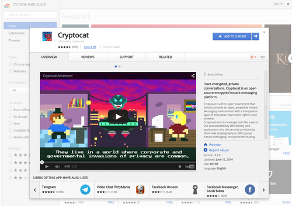 

2. Click the blue button labled **+ ADD TO CHROME** on the top right.

   

3. A popup will ask to “Confirm New App. Add 'Cryptocat'?” Please **click Add**. 

   

   A new "Getting Started" tab should open, along with a popup of all installed apps on the left of your browser. 

   

4. Click the **Cryptocat icon** to launch.

   

   Unable to launch Cryptocat? See [Launch Cryptocat](#launch-cryptocat) below for other methods.

In Firefox
----------

1. Go to [Cryptocat's Add-on Page](https://addons.mozilla.org/en-US/firefox/addon/cryptocat/) for Firefox.

   

2. Click the striped yellow and orange button that reads **+ Add to Firefox**. 

   

3. Allow the installation by clicking **Install Now**.

   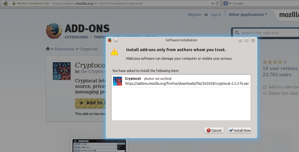

4. **Restart** Firefox.

5. After the browser has restarted, Cryptocat's icon of a red cat with a blue background should appear in the menu bar on the top right of your browser. 

   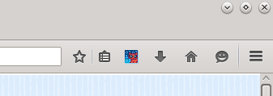

   If not, please follow step 6. Otherwise, continue to step 7.

6. To show the Cryptocat icon, click on the option menu (button with 3 bars) on the right of the browser. 

   

   Click **+ Customize** at the bottom.

   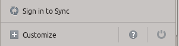
    
   You should see a set of icons under Additional Tools and Features. 

   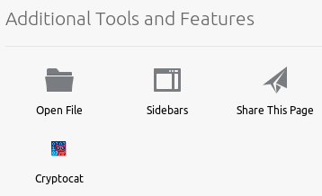

   Find the Cryptocat icon. **Click and hold**, then drag it with your mouse into the menu bar. 

   

   Click the green **Exit Customize** button on the bottom right.

   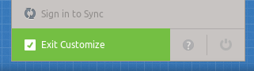

7. Click the **Cryptocat icon** located in the menu bar. A new tab launching Cryptocat should be displayed.

Using Cryptocat
===============

Launch Cryptocat
----------------

### In Chrome
There are three ways to launch Cryptocat.

+ **First Method** 

   1. Open a new tab and click on the **Apps** icon in the top left of the new tab.

      

   2. A **Cryptocat icon** will be shown. Click on it to launch the application.

   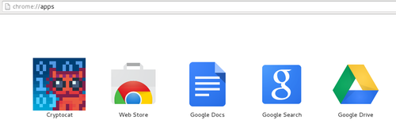

   If you have successfully launched Cryptocat please ignore the second and third method.

+ **Second Method**

   1. Copy the following address into your browser address bar : **chrome://apps/**

   2. Find and click the **Cryptocat icon** to launch the application.

   

   If you have successfully launched Cryptocat please ignore the third method.

+ **Third Method**

   1. Go back to the [installation link](https://chrome.google.com/webstore/detail/cryptocat/gonbigodpnfghidmnphnadhepmbabhij/related?hl=en)

   2. Click on the green button reading **Launch App**.

      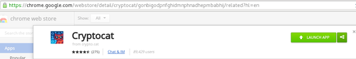

If all three methods fail, confirm you have downloaded and installed Cryptocat by reviewing the [Download and Install](#in-chrome) steps above for Google Chrome's web browser, or contact the Access Helpline.

### In Firefox

+ Click the **Cryptocat icon** in the menu bar of your browser. Cryptocat should open in a new tab on your browser.

   

If you do not see the Cryptocat icon in your menu bar, please review the [Download and Install](#in-firefox) steps above for the Firefox web browser to confirm proper installation of Cryptocat.

Create a Secure Chat
--------------------

+ After launch, Cryptocat opens a new tab in your browser with its home interface. 
   1. You will need to fill in two fields: 
      + Conversation name: you can choose any name that suits you.   
      + Nickname: choose any nickname you find appropriate.     
   2. After selecting a conversation name and nickname, click **connect**.

   

+ Invite your friend(s) to the conversation room by telling them the name you chose so they can type the same name. Before joining, they need to: 
   - Install Cryptocat. 
   - Launch it. 
   - Type the room's name into the conversation name field to join the same room. 
   - Type a nickname.  
   - Click **connect**.

|Note:|
|-----| 
|More than one person can join a conversation room|
|To have a private conversation with someone in the room, click their nickname. The nickname highlighted light blue is the conversation you are currently in. This allows you to send chats and files no one else in the group conversation room will be able to see. Click "Conversation" to return to the group chat.|
|To avoid viewing messages from an individual, click the drop down arrow next to their nickname and click "Ignore". You will no longer see their messages in the group chat or receive their private texts. Click the drop down arrow then "Unignore" to stop blocking them. Remember, other individuals in the chat will still see their messages, regardless of your personal "ignore" setting.|

Send an Encrypted File
----------------------

Cryptocat allows you to send encrypted files to individuals in the conversation room with you. Only images and zip files are allowed, up to 5MB.

**To Send a File:**
   
   1. Click the **down arrow** next to your friend's nickname.
   
   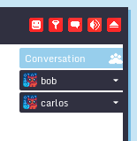 

   2. A drop down menu will appear. Click **Send encrypted file**.
   
   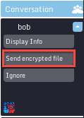

   3. After the encryption bar loads, a popup requires you to click **Send encrypted file**.
   
   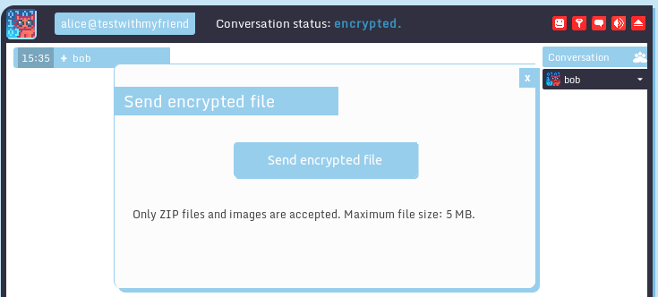

   4. **Select** the image or zip from your computer's files.

   5. The file will be sent after the loading bar reaches the other side.

**To Receive a File:**
   
   1. If you are not already in a private chat with the person who sent the file, their nickname will start to blink from black to light blue, signalling a message. **Click their nickname**. 
   
   

   |Note:|
   |-----|
   |Click **Conversation** above your friend list to return to the group chat after downloading the file to rejoin the group conversation.|

   2. You will see a loading bar message appear from the friend who is sending the file.

   3. After the bar loads, click the button reading **Download file**.

   

   4. **Save** the file to your preferred location.

Recommended Further Steps
-------------------------

We encourage you to follow the steps below to confirm the identity of the person you are talking with.

1. On the top right of the Cryptocat window, you will see the nicknames of the people in the room with you. 

   Click the **down arrow** next to your friend's nickname.

   

2. A drop down menu will appear. Click **Display Info**. 

   

   The popup the click opens should display that person's authentication status. 

   

   The first time you talk, the person you're chatting with is not yet authenticated (the checkmark is not checked). In other words, you are talking with an unverified person, who may or may not be who they say they are.

   

3. To authenticate the people in the chat with you, look to the bottom of the Display Info popup, beneath the fingerprints. You should see "Verify this user's identity by asking a secret question. Answers must match exactly!" Please create a secret question and answer, then click the ask button. 

   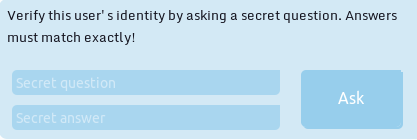

4. The person in the chat will receive your question and type his or her answer. It is important to share your secret question and answer in person, or through other secure channels, before asking in Cryptocat. 

5. If the person is who they say they are, proving it by successfully answering the question you sent, the authentication status will change to highlight the check, showing the person is verified.

   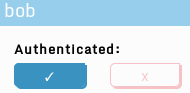

|Note:|
|-----|
|The answer to your secret question typed by your friend must be *exactly the same* as the answer you originally provided. This includes capitalization, punctuation, spacing, etc.|

For the highest level of confidence in the identity of your chat partners, you should **complete the question and answer process every time** you open a new conversation. Be careful of how you share your secret answer!

----------

This guide was brought to you by [Access](https://www.accessnow.org). 

**Share** -- Copy and redistribute the material in any medium or format.

**Adapt** -- Remix, transform, and build upon the material.

**Noncommercial** -- You may not use the material for commercial purposes.

