---

title: 'Encrypted Email Set-up for Windows'

abstract: This guide will help you set up encrypted email on Windows. The [Access Helpline](https://www.accessnow.org/pages/tech#Digital%20Security%20Helpline) is at your service if you have any questions. 

---
|Last updated: July 2015 |
|------------------------|
|Please consider this date when evaluating the accuracy and security of the following guide.|

|Before Beginning|
|----------------|
| In order to better protect the data on your computer, we highly recommend enabling device encryption before starting this guide. If your computer runs **Windows Pro**, enable [BitLocker encryption](http://windows.microsoft.com/en-us/windows-8/bitlocker-drive-encryption). If you have the **standard version of Windows**, use [DiskCryptor](https://ssd.eff.org/en/node/49). |

Download and Install Gpg4Win Using Satori
==========================================

To ensure Gpg4win's integrity, we will use a security tool called Satori to both download and verify your software. Satori is a Chrome extension. If you already have the browsers Chrome or Chromium on your computer, please skip Install Chrome and start at [Install Satori](#install-satori).

Install Chrome
---------------

1. Please [download](https://www.google.com/chrome/browser) Google Chrome by clicking the blue [Download Chrome](images/windows/images/chromeDownloadHome.png).

2. Accept the terms by clicking the blue **Accept and Install** button. Leave the boxes unchecked.

   

3. When the [popup](images/windows/images/chromeSaveFile.png) asks if you would like to save this file, Click **Save File**.

4. Click the download arrow in the top right of your browser, and click the Chrome's .exe file to begin the installation.

   

5. When the [popup](images/windows/images/chromeRunFile.png) asks if you would like to run this file, **click Run**. 

6. [Confirm](images/windows/images/chromeChangesToComputer.png) making changes to this computer by **clicking Yes**.

7. After installation completes, Chrome will automatically [open](images/windows/images/chromeWelcome.png).

Install Satori
---------------
1. Please visit the [Chrome Web Store](https://chrome.google.com/webstore/category/apps) and [search Satori](images/windows/images/chromeWebStore.png).

2. Satori should be the first result of the search. Please click the blue **+ ADD TO CHROME** button.

   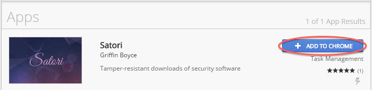

3. Click **Add app** to [add Satori](images/windows/images/chromeSatoriWebStoreAdd.png).

   A [new tab](images/windows/images/chromeSatoriAdded.png) will confirm that Satori has been added to the Chrome App Launcher.

4. Click the Chrome App Launcher  and select the Satori icon to open Satori.

   

Download Gpg4Win
----------------

1. Once Satori loads, [choose](images/windows/images/satoriEnglish.png) your preferred language. This guide follows the English instructions.

2. Look under the software available for Windows. Find Gpg4Win and **select the letter A or B**. A is from Amazon S2, B is from Github: either one is fine. Your download will begin.

   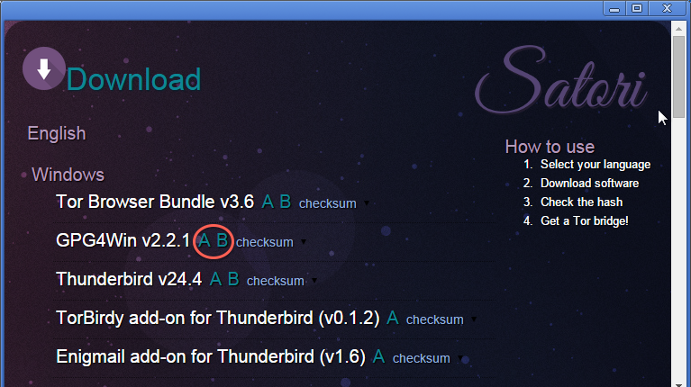

   Before completing Gpg4Win's installation, you should confirm your downloaded copy has not been tampered with.

Verify the Integrity of Your Downloaded Gpg4Win
-----------------------------------------------

1. In Satori, after selecting your preferred language, **click the checksum link** next to the Gpg4Win software you downloaded. A long string of numbers and letters should appear.

   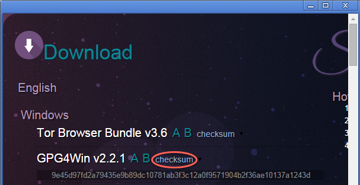

2. Scroll down to the bottom of the screen, and under Generate Hash **click Select Files**.

   

3. Select your Gpg4Win .exe file from your downloads folder. **Click Open**. A long string of numbers and letters should apear.

4. Visually compare the string of numbers and letters under the Gpg4Win software above and the string you just created under Generate Hash. 

   If they match, your software has not been tampered with and you may continue this guide. If they do not match, please try downloading again from the letter you *did not* choose the first time. 

   After trying the other letter, if the checksum and hash still do not match, please [contact the Helpline](https://www.accessnow.org/pages/tech#Digital%20Security%20Helpline) for further instructions.

Continue Your Gpg4Win Installation
----------------------------------

1. In Chrome, **click the three-bar menu** in the top right, then Downloads. **Click the Gpg4Win .exe file**.

   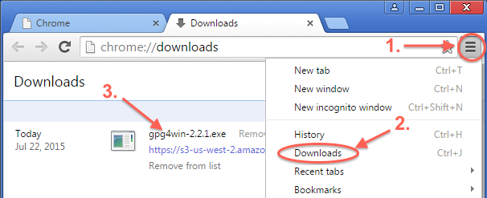

2. **Click Yes** when you see the [popup](images/windows/images/windowsPgpGpg4WinMakeChangesToComp.png) asking if you "...want to allow the following program to make changes to this computer?"

3. Select your preferred [Installer Language](images/windows/images/windowsPgpGpg4WinLanguage.png) from the dropdown. Click OK.

4. The Gpg4win Setup wizard will appear.

   + **Click Next >** on the [first page](images/windows/images/windowsPgpGpg4WinInstallWizard1.png) of the wizard

   + **Click Next >** to agree to the [License Agreement](images/windows/images/windowsPgpGpg4WinInstallWizard2.png)

   + Pick components you wish to download: 

      + **Uncheck GpgOL**, unless you use Outlook

      + If you *want* to eventually encrypt files, please **keep all** other components **except for Claws-Mail**.

      + If you *do not want* to create encrypted files, **keep the Gpg4win Compendium** and uncheck all other components

   + **Click Next >**

   
   
   + Select a [destination folder](images/windows/images/windowsPgpGpg4WinInstallWizard4.png)--using the default is fine. **Click Next >**.

   + Choose where you would like to launch Gpg4win from. We suggest the [Quick Launch Bar](images/windows/images/windowsPgpGpg4WinInstallWizard5.png). You may choose more than one place. **Click Next >**.

   + After [allowing the bar to load](images/windows/images/windowsPgpGpg4WinInstallWizard7.png), complete installation by **clicking Next >**, then **Finish** on the Setup Wizard's [final page](images/windows/images/windowsPgpGpg4WinInstallWizard8.png).

Download and Install Thunderbird
=================================

1. Please visit [Thunderbird's website](https://www.mozilla.org/en-US/thunderbird/) to download this email application.

2. Click the green **Download Thunderbird** button.

   

3. [Save File](images/windows/images/windowsPgpThunderbirdSaveFile.png) 

4. Click the download arrow in the top right of your browser. **Click the Thunderbird .exe file** in your recent downloads.

   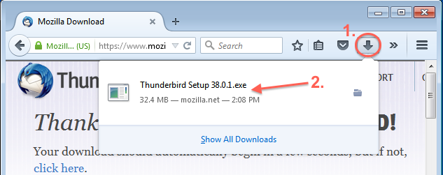

5. Choose to [Run the file](images/windows/images/windowsPgpThunderbirdRunFile.png) and allow the program to make changes to the computer by clicking **Yes**.

   

6. Complete the Thunderbird Installation Wizard

   + **Click Next >** to [begin](images/windows/images/windowsPgpThunderbirdInstallWizard1.png).

   + Choose [Standard Installation](images/windows/images/windowsPgpThunderbirdInstallWizard2b.png). 

|Note:|
|-----| 
| Thunderbird will be set as your default mail application. If you do not wish for this to be the case, **uncheck Use Thunderbird as my default mail application** at the bottom.|

   + Click **Install** to allow Thunderbird to be installed in the noted [directory](images/windows/images/windowsPgpThunderbirdInstallWizard5a3b.png).

   + Click **Finish** to complete the Setup Wizard. Make sure to launch Thunderbird before continuing to the Download and Install Enigmail Section. 
 
   + After installation, [Thunderbird will ask](images/windows/images/windowsPgpThunderbirdIntegration.png) if you want to set Thunderbird as your default client for Email, Newsgroups, and Feeds. If you desire it to be the default, **Set as Default**. If not, **Skip Integration**.

|Note:|
|-----|
|A [popup](images/windows/images/windowsPgpThunderbirdUseExistingEmail.png) will ask if you would like a New Email address to use Thunderbird. This guide assumes you already have an email account. If this is true, Select **I think I'll configure my account later** to continue following this guide.|

Download and Install Enigmail
============================== 

Enigmail is an encryption/decryption add-on for Thunderbird. 

1. Open Thunderbird and **click the three-bar menu button**  at the top, on the right.

2. Click **Add-ons**.

   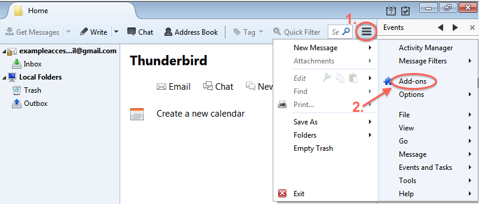

3. Type "Enigmail" in the search field on the right. The first result should read "Enigmail", **click install**.

   
   
4. [When prompted](images/windows/images/windowsPgpEnigmailRestart.png), restart Thunderbird to let the Add-on finalize its installation

5. When the Enigmail Setup Wizard starts, click **Configure Enigmail later** then **Next >**. We will change Enigmail's settings later in this guide.

Show the Thunderbird Menu Bar
=============================

This step will be useful for the rest of this guide.

1. In Thunderbird, click the three-bar menu button, then Options  then **check Menu Bar**.

   

Link Thunderbird to Your Existing Email 
=======================================

1. Show the [Thunderbird Menu Bar](#show-the-thunderbird-menu-bar).

2. Look at the Menu Bar to the top left. Click **File**, then click **New**, then **Existing Mail Account**.

   

3. Fill out your complete name, your email address and your password. 
It’s important to fill out your First and Last name if you want the receiver to recognize you.

   

4. Click **Continue**.

Upgrade Security Settings for Thunderbird
-----------------------------------------

1. Open Thunderbird and **click the three-bar menu button**  at the top, on the right.

2. **Click Options**, then **Account Settings**. 

   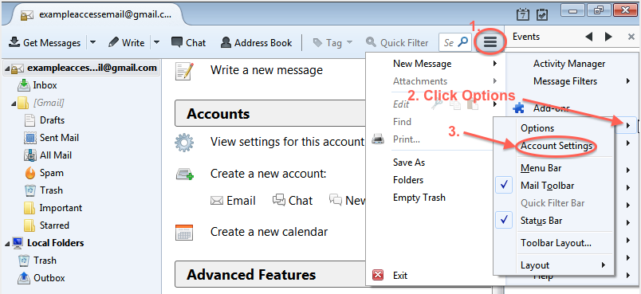

3. Click **OpenPgp Security** on the left. Everything should be checked. Make sure "Use specific OpenPGP key ID" is selected, with your public key below it. **Click OK**.

   

Create a Private and Public Key: Your Key Pair
=================================================

1. In the [Thunderbird Menu Bar](#show-the-thunderbird-menu-bar), click **Enigmail** then choose **Key Management**.

   

2. A window should appear. **Check Display All Keys by Default** to the right of the Search box.

   

3. Select **Generate** from the menu at the top, and choose **New Key Pair**.

   

4. Choose a secure passphrase (password) for your keys. It should be long, include special characters, capital letters and numbers. You must remember this passphrase. 
You may leave the "Comment" section blank.

   

5. Underneath the comment line, you will see a key expiration date. Please check the box that reads "Key does not expire."

6. Click on the **Advanced tab** next to Key Expiry, and **confirm the key size is 4096**. 

   

7. Click [Generate Key](images/windows/images/windowsPgpGenerateKeyConfirmGenerateKey.png) and confirm.

|Note:|
|-----| 
|You will also be asked to [generate a revocation certificate](images/mac/images/macPgpGenerateRevocationCertificateAskFull.png). Please do so by clicking **Generate Certificate**, and save it in a secure location (like a usb stick that you keep for exclusive, personal use).|

Find out more in the following section.

Generate a Revocation Certificate
===============================

This step will allow you to discontinue use of your key securely at any time. **It is very important to create a revocation certificate for future use.** Revoking your key will prevent people from encrypting to the revoked key, and signals to the keyservers that the key is no longer valid. 

If you did not create a revocation certificate in the section above, please do so now. 

1. Go to the [Thunderbird Menu Bar](#show-the-thunderbird-menu-bar). Click **Enigmail**, and choose **Key Management**.

    

2. Find the key that you would like to generate a revocation certificate for, and **right click** on it. 

3. Select **Generate and Save a Revocation Certificate** from the menu.

   

4. Choose a secure location to save your revocation certificate. An encrypted USB stick that you do not lend out and is kept for exclusive, personal use is a good choice.

5. Type in your [passphrase](images/windows/images/windowsPgpGenerateKeyEnterPassphraseMini.png) and **click OK**.

6. You will be [notified](images/windows/images/windowsPgpCertificateSuccessfullyGenerated.png) the revocation key was successfully generated. **Click OK**.

Store Your Key Pair Somewhere Safe
==================================

This is important if you want to use encryption on another computer, or your hard drive is wiped.

1. **Right click your key** in [Key Management](images/windows/images/windowsPgpThunderbirdMenuEnigmailKeyManagement.png) and choose **Export Keys to File**.

   

2. Choose explicitly to **Export Secret Keys**.
   
   
   
3. Choose where you would like the keys to be saved. 

   | Note: |
   |-------| 
   | Your keys are the most important component of the encryption system, and their security should be top priority. **Only export to a secure place**, like an encrypted USB stick you use exclusively and do not lend out.|

4. Click **Save**. You should see a [keys were successfully saved](images/windows/images/windowsPgpKeysSuccessfullySaved.png) message.

Publish Your Public Key
========================

Others must import your public key to encrypt messages to you. To let others find your public key, you may upload your public key to a key server or attach the key in an email. Public keys uploaded to key servers are searchable by the email used or PGP Key ID. 

1. Go to [Thunderbird's Menu Bar](#show-the-thunderbird-menu-bar). Click **Enigmail**, then **Key Management**. 

   

2. Right click on your key and choose: **Upload Public Keys to Keyserver**.

   

3. **Click OK** on the default option: whatever keyserver you choose will be mirrored on the other servers. 

   

Send Your First Encrypted Email
===============================

Download Your Receiver’s Public Key
-----------------------------------

1. From [Thunderbird's Menu Bar](#show-the-thunderbird-menu-bar) select **Enigmail**, then **Key Management**.

    

2. In Enigmail's menu bar select **Keyserver** then **Search for Keys**.

   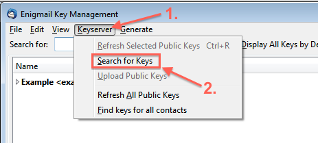

3. Search for a key by typing the email of the receiver or the ID of the PGP key.

   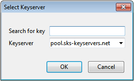

4. **Select the key** from the import window and **click OK**.

   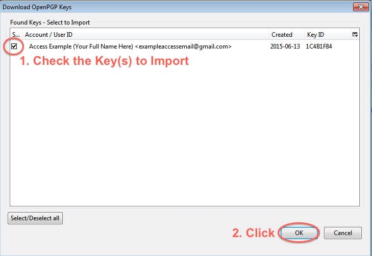 

5. A message will appear saying that the [key has been imported](images/windows/images/windowsPgpKeyImportedSuccessfully.png). **Click OK**.

   Once the public key of the receiver is downloaded, you may send them an encrypted email.

Send the Email
--------------

1. In Thunderbird's window, click **Write** on the top left.

   

2. Confirm the **Lock and Pencil are highlighted** in the top left of the opened window. This shows the email is encrypted and signed. If it is not, [review](#upgrade-security-settings-for-thunderbird) Thunderbird's security settings before continuing.

   [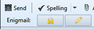](images/windows/images/windowsPgpHighlightedLockPencilFull.png)

3. Type the receiver's email address in *To*, write the *Subject* and your email message. **Click Send** when complete.

   |Security Note:|
   |-----| 
   | **The Subject of the email is never encrypted**. *Do not* write private information in the subject line under any circumstances.|

    

4. After clicking Send, you must [fill out your Passphrase](images/windows/images/windowsPgpPassphraseEmailSend.png) and **click OK**.

Add Your PGP ID to Your Email Signature
========================================

1. In [Thunderbird's Menu Bar](#show-the-thunderbird-menu-bar), **click Tools** then [Account Settings](images/windows/images/windowsPgpThunderbirdToolsAccountSettings.png).

2. Find your PGP key under OpenPGP Security in the column menu on the left and **copy it**. 

     
   
3. **Click your email** in the left column menu.

4. **Paste your key** under Signature text.

   [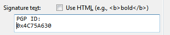](images/windows/images/windowsPgpAccountSettingsSignatureTextFull.png)

----------

This guide was brought to you by [Access](https://www.accessnow.org). 

 

**Share** -- Copy and redistribute the material in any medium or format.

**Adapt** -- Remix, transform, and build upon the material.

**Noncommercial** -- You may not use the material for commercial purposes.

